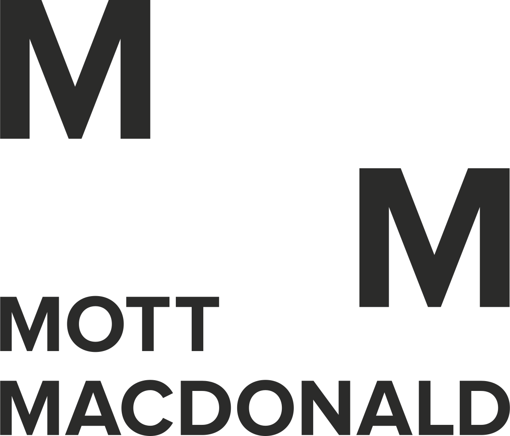

	
	<h3><b>Opening opportunities with connected thinking.   
	We turn the obstacles you face into sustainable infrastructure and development solutions.</b></h3>

## Get Involved 💻

Right now, we are already building amazing tools together, and there are excellent "good first issue" opportunities, if you're looking to get involved.

* How to join a team.
* How to create a team.
* How to create a repo.
* How to contribute to other repos.

----

## Do you need some introduction learning? 📖
* [GitHub basic leaerning path](https://portal.pinnacleseries.com/#/learningcenter/series?learningPathId=a6b54a3d-cba1-42cd-8935-7bc57eb68f56)
* [GitHub intro](https://portal.pinnacleseries.com/#/home)
* [GitHub learning lab 1hr course](https://lab.github.com/githubtraining/introduction-to-github)
* [GitHub learning about team](https://docs.github.com/en/enterprise-server@3.3/organizations/organizing-members-into-teams/about-teams)
